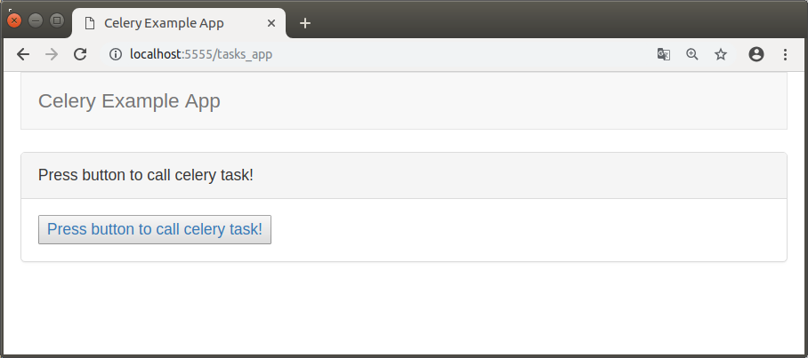
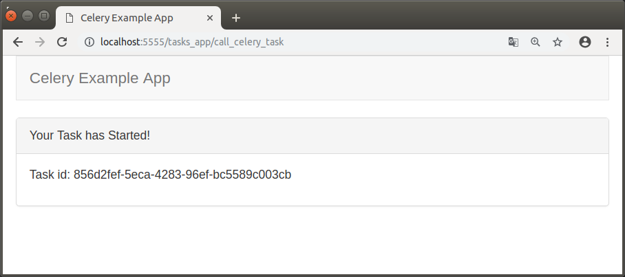
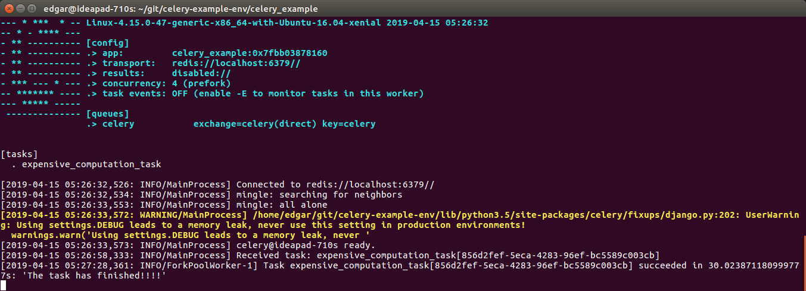

CELERY EXAMPLE APP
---------------------------------------------------------------------------------------------------------------------

Sencilla aplicación desarrollada con Django 2.2 y Celery 4.3 que 
muestra un pequeño ejemplo de ejecución de una tarea asincrónica.

La aplicación utiliza Redis como broker de mensajería.

**Configuración de Celery en archivo settings para utilizar Redis como broker:**

CELERY_BROKER_URL = 'redis://localhost:6379'

---------------------------------------------------------------------------------------------------------------------

Pantalla desde donde se gatilla llamada a tarea celery:

Pantalla de respuesta que indica id de la tarea generada:

Ejecución de la tarea gatillada:

---------------------------------------------------------------------------------------------------------------------

